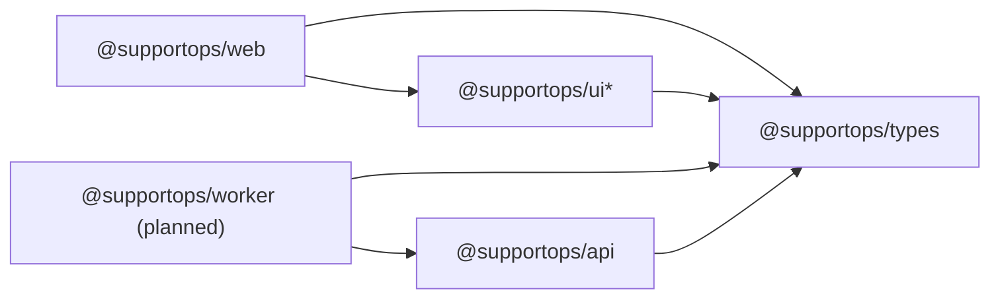

# Dependency Map (Monorepo)

## Current packages
- Apps: `@supportops/web`, `@supportops/api`, `@supportops/worker` (planned)
- Shared: `@supportops/types`, `@supportops/ui`, `@supportops/ui-form`, `@supportops/ui-theme`, `@supportops/ui-avatar`, `@supportops/ui-file-upload`, `@supportops/ui-dialog`
- Tooling: `@supportops/eslint-config`, `@supportops/tsconfig`

## Allowed dependency direction

## Forbidden imports
- `@supportops/types` must not import from `apps/*` or `@supportops/ui*`.
- `@supportops/ui*` must not import from `apps/*`.
- `@supportops/api` must not import from `@supportops/web`.
- `@supportops/worker` must not import from `@supportops/web`.

## Why this direction
- Keep low-level packages stable (`types` lowest layer).
- Avoid circular dependencies and hidden coupling.
- Make upgrades/refactors local (change in `web` does not force `types` changes).

## Peer dependency policy
- `@supportops/ui*` keeps React runtime libraries as `peerDependencies`:
  - `react`
  - `react-dom`
  - `react-hook-form`
  - `@tanstack/react-table`
- App layer (`@supportops/web`) provides concrete versions.

## Versioning policy (current stage)
- Internal packages use `workspace:*`.
- No per-package public release flow yet.
- Treat repo as one release unit until independent publishing is needed.
